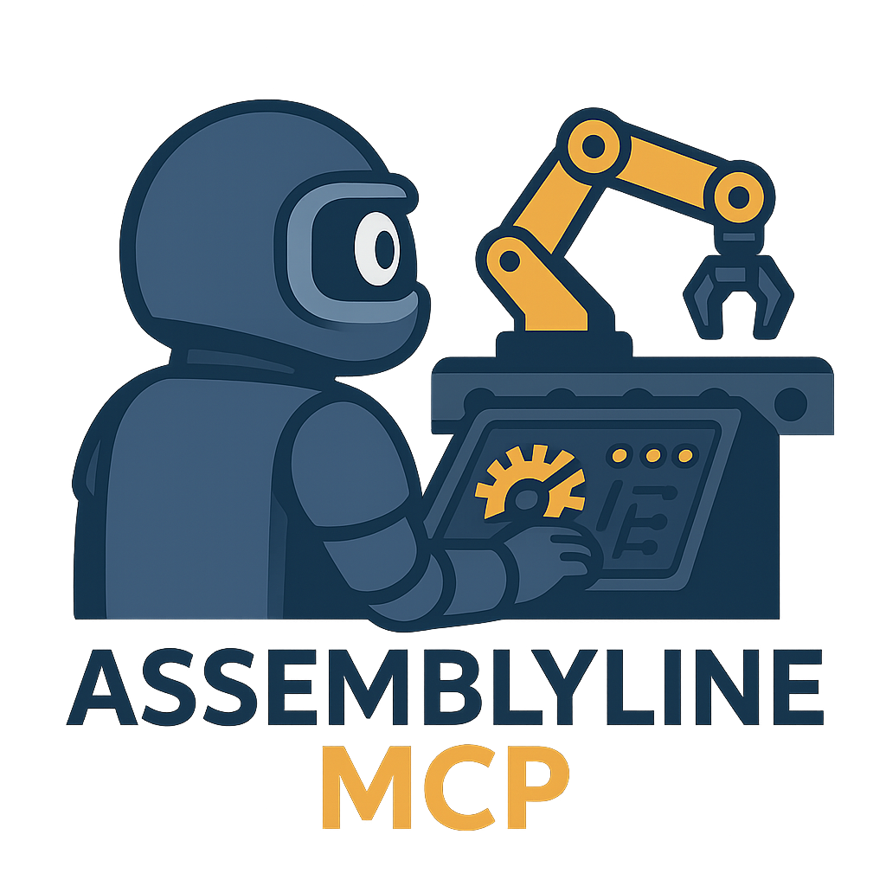

<!-- Logo -->
<p align="center">
  
</p>

<!-- <h1 align="center">Assemblyline MCP</h1> -->

<p align="center">
  Model Context Protocol (MCP) for AssemblyLine! 
  <br />
  <a href="#getting-started"><strong>Explore the docs »</strong></a>
</p>

<p align="center">
  
  
  
</p>

---

## 📚 Table of Contents

- [About](#about)
- [Features](#features)
- [Getting Started](#getting-started)
- [Authors](#contact)

---

## 🧾 About

**Assemblyline MCP** is a modular server implementation for the Model Context Protocol (MCP), providing seamless programmatic integration with Assemblyline malware analysis automation.
This project allows you to expose Assemblyline's powerful analysis APIs via MCP, making it easy to connect Assemblyline to other automations, agents, or orchestration platforms.

---

## ✨ Features

- Modular component system for each Assemblyline API area (alerts, files, services, etc)
- Real-time task coordination via MCP
- Extensible configuration interface
- Designed for integration with industrial automation and cyber defense systems
- Logging and monitoring of process flows
- Pythonic, fully type-hinted API surface
- Compatible with Python 3.9+
---

## 🚀 Getting Started

### Prerequisites

Make sure you have the following installed:

- Python 3.9+
- venv
- Git

### Installation

```bash
# Clone the repository
git clone https://github.com/brandonlhill/assemblyline-mcp.git

# Navigate into the project directory
cd assemblyline-mcp

# (Optional) Create a virtual environment
python -m venv venv
source venv/bin/activate  # On Windows: venv\Scripts\activate

# Install dependencies
pip install -r requirements.txt

```

### Usage
Configure your Assemblyline MCP server by editing the configuration files or environment variables as needed.

Start the FastMCP server:
```shell
python run_server.py
```

## Authors
- [@brandonlhill](https://www.github.com/brandonlhill)

## Acknowledgements
- [@CybercentreCanada](https://github.com/CybercentreCanada/assemblyline/)
- [@UMBC](https://umbc.edu/)